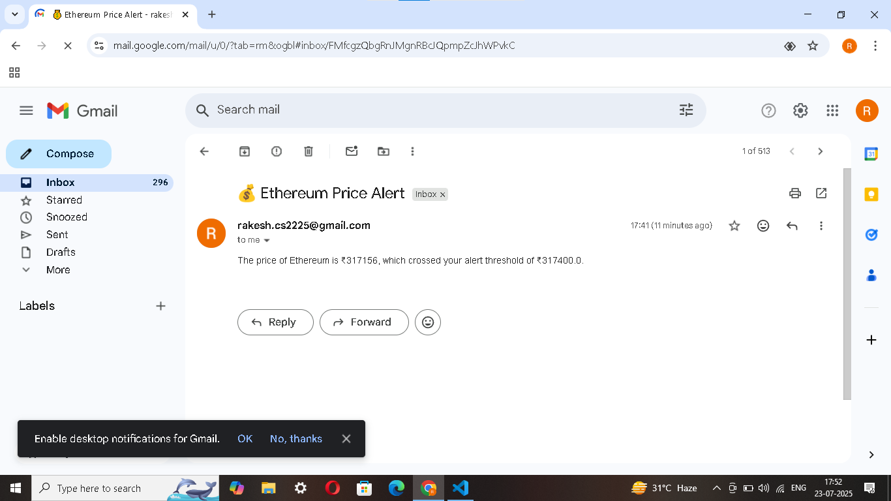

📈 Crypto Price Tracker with Alerts (Streamlit App)

Track live cryptocurrency prices in real-time, set custom alert thresholds, and receive email notifications when prices meet your conditions. The app also displays historical trends via auto-updating line charts.

🚀 Features

✅ Real-time price tracking using the CoinGecko API

✅ Supports popular cryptocurrencies (Bitcoin, Ethereum, Dogecoin, Solana)

✅ Set alert thresholds in INR

✅ Sends email alerts when thresholds are crossed

✅ Live-updating price table and line chart

✅ Auto-refresh interval configurable by user

✅ Log of all triggered alerts saved to alert_log.txt

🧰 Tools & Libraries
1 . Python 3.15

2 . Streamlit – for UI

3 . requests – for fetching API data

4 . smtplib, email – for sending alerts via email

5 . pandas, datetime – for data handling and trend visualization

🔧 Installation
1.Clone the repository

git clone https://github.com/your-username/crypto-price-tracker.git
cd crypto-price-tracker

2.Install dependencies

pip install -r requirements.txt

3.Run the app

streamlit run tracker.py

✉️ Gmail Setup for Alerts

To send email alerts:
1.Use a Gmail account
2.Go to https://myaccount.google.com/apppasswords
3.Generate a new App Password for “Mail”
4.Enter the generated App Password in the sidebar input

⚠️ Never use your actual Gmail password — only App Passwords

⚙️ Usage Guide

*Select the cryptocurrencies to track
*Set a price threshold for each
*Enter sender/receiver email credentials in the sidebar
*The app tracks automatically and sends alerts when thresholds are crossed
*Price trends update in real-time

📂 Files Included

File Description
tracker.py	     | Main Streamlit app script
alert_log.txt    |	Auto-created file to log alerts sent
requirements.txt |Python dependencies
README.md        |This file

🧪 Example Email Alert

Subject: 💰 Bitcoin Price Alert
Body:

The price of Bitcoin is ₹2780000, which crossed your alert threshold of ₹2800000.

✅ To-Do (Future Enhancements)

1.Add desktop notifications

2.Support more currencies (USD, EUR)

3.Save tracking history to file

4.Export data as CSV

Sample Alert Email:

📜 License
MIT License. Free to use, modify, and share.